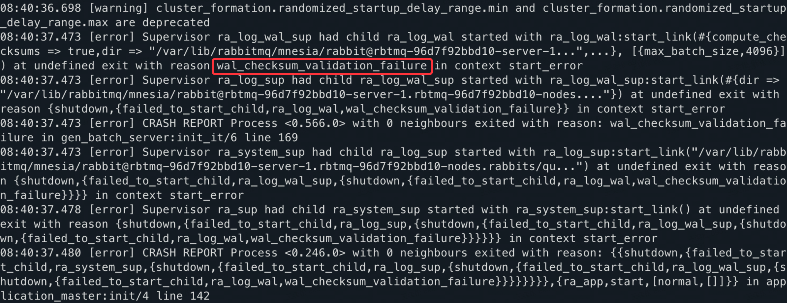

## Introduction
Before rabbitmq/ra v2.0.13, after an unclean shutdown (eg: the host node abruptly shutdown in power off), the RA node may stuck at restarting. For details please refer to this [issue](https://github.com/rabbitmq/ra/pull/284).

When you hit this issue, the error stack in your logs may looks like this one:


We provide this script to help you fixing the corrupted WAL file, and recover you RA node.

**keywords**: 
- wal_checksum_validation_failure 
- RabbitMQ
- RA

## Usage
- Step 1: Find the WAL file. For RabbitMQ, typically it's in **Raft data directory**, which can get from **rabbitmqctl status** command.
- Step 2: Copy the WAL file to your workspace.
- Step 3: Run ra_wal_tinker.py To analyze entries in WAL file.
- Step 4: Optional: Run ra_wal_tinker.py with flag *--truncate* to truncate off the corrupted entries.
- Step 5: Run ra_wal_tinker.py again to validate the checksum for the WAL file.
- Step 6: If checksum validation pass, then you can replace your original WAL file with the truncated WAL file.
- Step 7: Try restart your application.

```
// Scan the WAL file and get a summary
python3 ra_wal_tinker.py {path_to_your_wal_file}

// Truncate the WAL file
python3 ra_wal_tinker.py {path_to_your_wal_file} --truncate
```

## Requirement
- python3
